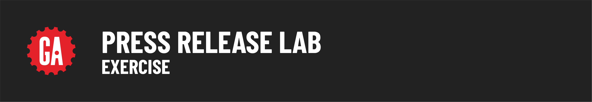

# 

In this lab, you will first start by building out the HTML and then adding stylizationg with CSS. You will complete each exercise using the base press release langauge provided. Get creative! While you will have a set of requirements to meet in each exercise, you can add your own style to the press release. 

## Press Release Text

For Immediate Release

General Assembly, which started in New York as a startup incubator, now offers classes and workshops in technology, design, and entrepreneurship, with campuses around the world in:
	
Berlin, Boston, Hong Kong, London, Los Angeles, New York City, San Francisco, Sydney, Washington D.C

For more information, visit General Assembly's

## Lab Exercise

Before getting started, make sure you properly [setup](../setup/README.md) your lab and have both your `index.html` file and `style.css` file. 

<!-- Note from Madi: I started to work on lesson exercise, but I think it would be better for else to define the requirements. I've at least started the first draft!-->

### HTML Stucturing

1. Change the title
1. Add at least one image
1. At least one `<h1>`
1. At least one `<h2>`
1. At least one `<h3>`
1. At least one `
`
1. A list `<ul>`

### CSS Styling

1. Change the background color
1. Change the font 
1. Define at least two classes
