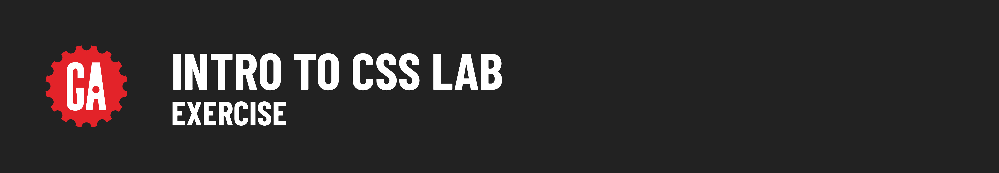

# 

## Lab Exercise: Building and Styling a `Press Release`

Welcome to the HTML and CSS lab! In this exercise, you'll build and style a press release. This is a great opportunity to practice your HTML and CSS skills. Be creative and have fun!

### Getting Started

1. **Setup**: Before you begin, ensure you've completed the [setup](../setup/README.md) steps, including creating both an `index.html` and a `style.css` file.
2. **Files Needed**:
   - `index.html`
   - `style.css`

### Instructions

You'll be provided with plain text for a GA press release. Your task is to structure and style this content using HTML and CSS. You have the freedom to decide which HTML elements to use and how to style them.

### Technical Requirements

1. **HTML**:
   - Use appropriate HTML elements to structure the content.
   - Each piece of content must be wrapped in an HTML tag.
   - Nest elements logically and semantically.

2. **CSS**:
   - Apply at least 5 different CSS rules.
   - Use at least 5 different CSS properties to style the elements.

### Press Release Content

Copy and paste the following text into your `index.html` file:

```plaintext
For Immediate Release

General Assembly, which started in New York as a startup incubator, now offers classes and workshops in technology, design, and entrepreneurship, with campuses around the world in:

Berlin, Boston, Hong Kong, London, Los Angeles, New York City, San Francisco, Sydney, Washington D.C

For more information, visit General Assembly's Website (https://www.generalassemb.ly)
```

### Helpful Assets

- Fonts: Check out Oswald and Roboto from Google Fonts!
- GA Red: Use `rgb(226,28,35)` for the GA Red color.
- Logo: Use the logo from this [link](https://res.cloudinary.com/dr5iclm3d/image/upload/v1548206606/logo.png).

Remember, this is your chance to experiment and express your creativity through coding. Try different HTML elements and CSS styles, and see what works best. Don’t be afraid to make mistakes—that’s how you learn!

Have fun, and happy coding! 🚀